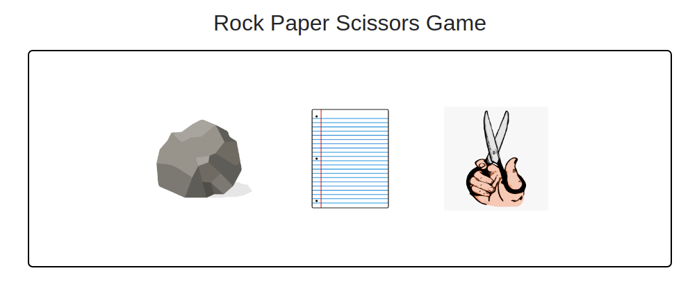

# Rock-Paper-Scissors Game

## Description:
A Small Fun Game about rock, paper and scissors

## Technologies:

- HTML
- CSS
- Javascript

## Developed by

Mouhamadou Diouf ( <a href="https://github.com/MouhaDiouf"> @mouhad </a>)

## Contributing

1. Fork it (https://github.com/MouhaDiouf/Rock-Paper-Scissors)
2. Create your feature branch (git checkout -b feature/[choose-a-name])
3. Commit your changes (git commit -am 'What this commit will fix/add')
4. Push to the branch (git push origin feature/[chosen name])
5. Create a new Pull Request

## Live version:
<a href="https://mouhadiouf.github.io/Rock-Paper-Scissors/" target="_blank">Blackjack Game</a>
